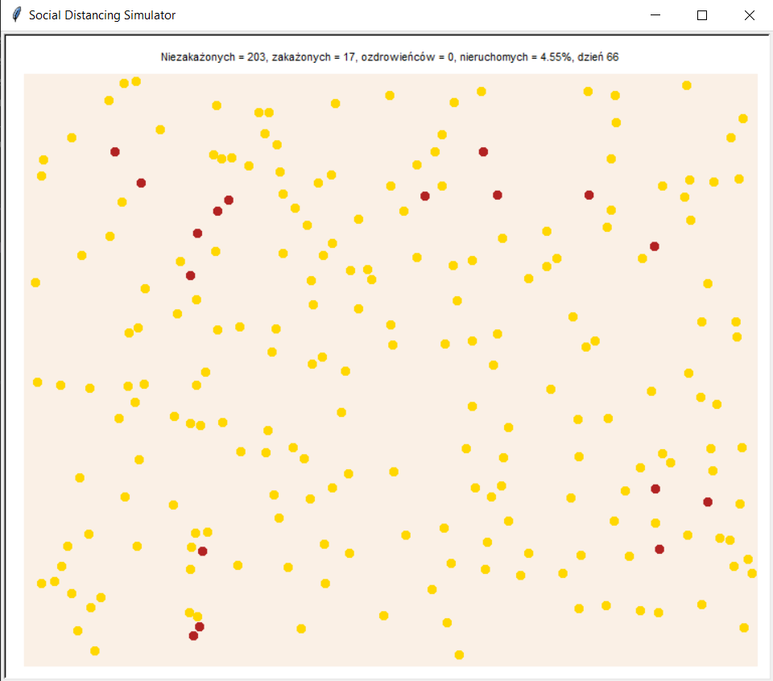

# social_distancing_simulation

A simple animated simulation of the effect of social distancing on spreading of an infectious disease. Implemented a simplistic collision model, which allows the subjects to move around in the simulation plane and bounce off of each other.

